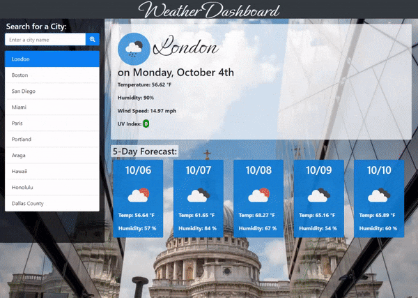
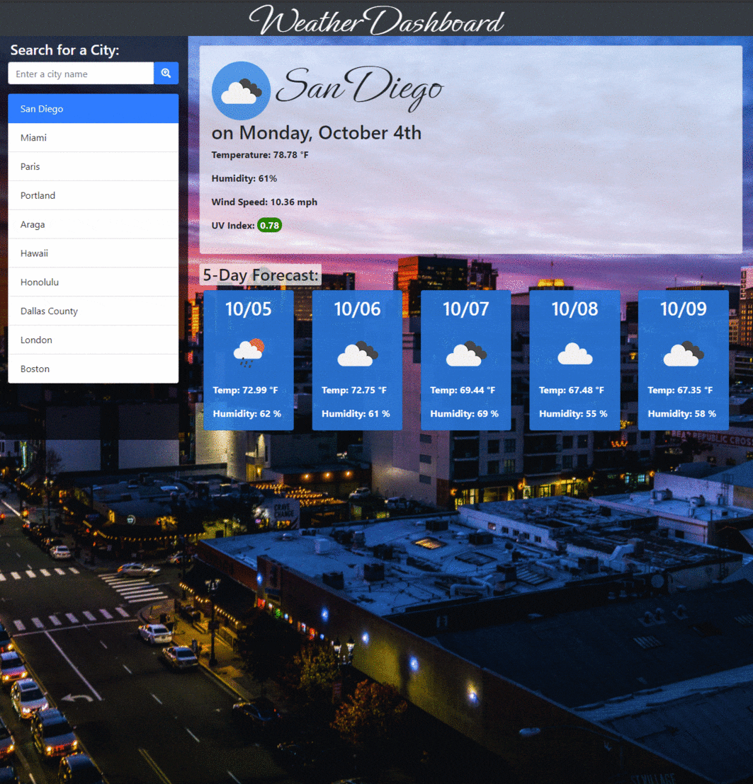
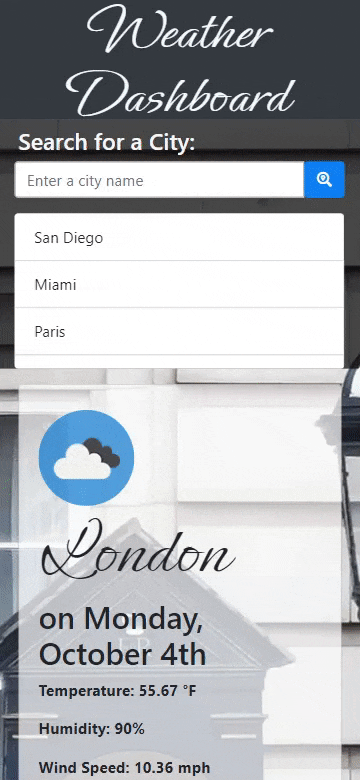

# Weather Dashboard

This is a weather dashboard for displaying weather reports for multiple cities, utilizing data from the [OpenWeather API](https://openweathermap.org/api). Cities can be searched for by name and are kept in a search history displayed below the input, up to a maximum of 10. The newest searched cities are added to the top of the list, and any repeat searches are moved to the top of the list. This search history is retained across sessions, and on page load, the most recently searched city is shown automatically.

Background photos of the searched city are randomly selected using the [Unsplash API](https://unsplash.com/developers).

### Mobile View

The dashboard has also been optimized for mobile viewing, with the search history being collapsed into a scrollable section.

---

## Getting Started

These instructions will get you a copy of the project up and running on your local machine for development and testing purposes. See deployment for notes on how to deploy the project on a live system.

### Prerequisites

* IDE to view/edit source code (e.g. Visual Studio Code).

### Installing

1. Clone repository.
1. Open [index.html](index.html) in web browser.

### Deployment

1. Upload index.html and assets folder to webhosting site, such as GitHub.
1. If using GitHub, deploy via GitHub Pages.

---

## Built With

* [JavaScript](https://developer.mozilla.org/en-US/docs/Web/JavaScript)
* [jQuery](https://jquery.com/)
* [Bootstrap](https://getbootstrap.com/)
* [HTML](https://developer.mozilla.org/en-US/docs/Web/HTML)
* [CSS](https://developer.mozilla.org/en-US/docs/Web/CSS)
* [GitHub](https://github.com/)

## Deployed Page

* [See Live Site](https://starryblue7.github.io/weather-dashboard/)

## Author

Vince Lee
- [Portfolio](https://starryblue7.github.io/portfolio/)
- [Github](https://github.com/StarryBlue7)
- [LinkedIn](https://www.linkedin.com/in/vince-lee/)

## License

License: [MIT License](https://vince-lee.mit-license.org/)

## Acknowledgments

* Weather and location data provided by OneCall API and Geocoding API from [OpenWeather](https://openweathermap.org/api).
* Random background images provided by [Unsplash](https://unsplash.com/developers).
* Custom font from [Google Fonts](https://fonts.google.com/).
